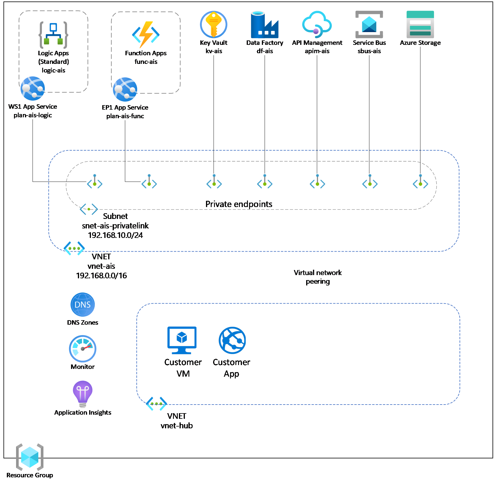
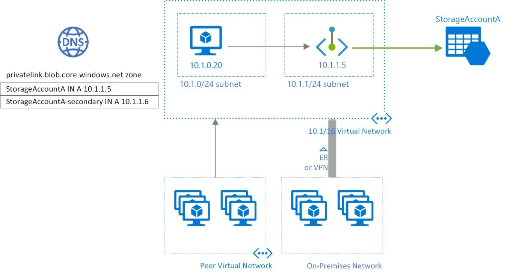
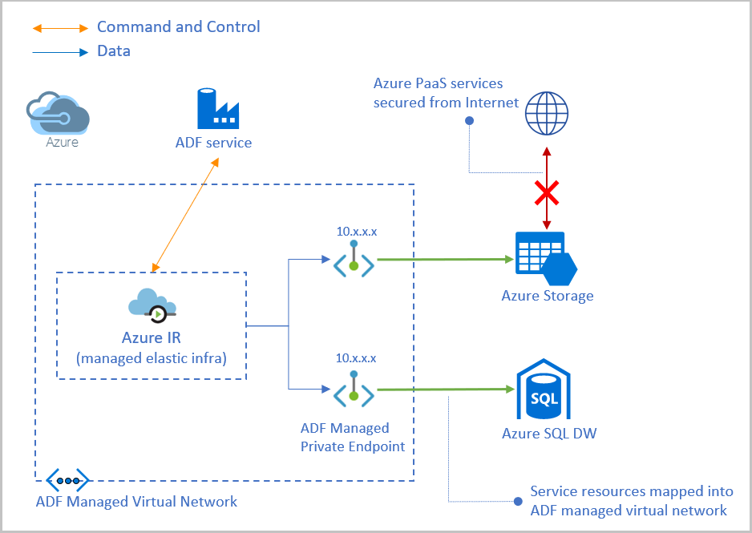
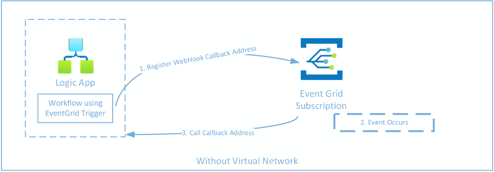
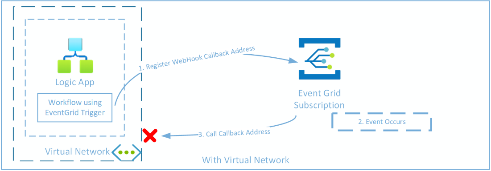
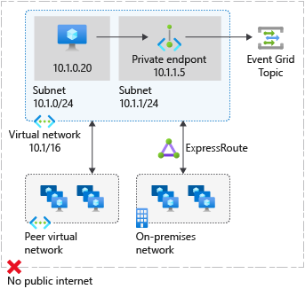

# Network topology and connectivity

## Define an Azure network topology

Enterprise-scale landing zones support two network topologies: one based
on Azure Virtual WAN and the other a traditional network topology based
on a hub-and-spoke architecture.

## Design considerations

Use a network topology based on [Virtual
WAN](https://learn.microsoft.com/en-us/azure/cloud-adoption-framework/ready/azure-best-practices/virtual-wan-network-topology)
if your organization:

- Plans to deploy resources across several Azure regions and requires
  global connectivity between VNets in these Azure regions and multiple
  on-premises locations.

- Needs to Integrate a large-scale branch network directly into Azure,
  either via a software-defined WAN (SD-WAN) deployment or requires more
  than 30 branch sites for native IPsec termination.

- You require transitive routing between VPN and ExpressRoute, such as
  remote branches connected via Site-to-Site VPN or remote users
  connected via Point-to-Site VPN, require connectivity to an
  ExpressRoute connected DC, via Azure.

Organizations use Virtual WAN to meet large-scale interconnectivity
requirements. Microsoft manages this service, which helps reduce overall
network complexity and modernize your organization's network.

Use a [traditional Azure network
topology](https://learn.microsoft.com/en-us/azure/cloud-adoption-framework/ready/azure-best-practices/traditional-azure-networking-topology)
based around a hub-and-spoke architecture if your organization:

- Plans to deploy resources in only select Azure regions

- Doesn't need a global, interconnected network

- Has few remote or branch locations per region and needs fewer than 30
  IP security (IPsec) tunnels

- Requires full control and granularity to manually configure your Azure
  network

### Reference Network Topology

The following architecture diagram shows the reference architecture for
an AIS enterprise deployment:

## Plan for IP addressing

Enterprise deployment of AIS will implement Private Endpoints and
Virtual Networks. It's vital to [plan for IP
addressing](https://learn.microsoft.com/en-us/azure/cloud-adoption-framework/ready/azure-best-practices/plan-for-ip-addressing)
in Azure to ensure that:

- The IP address space doesn't overlap across on-premises locations and
  Azure regions.

- The Virtual Network (VNet) contains the correct address space.

- Subnet configuration is thought out in advance.

### Design Considerations

- Some AIS services require [dedicated
  subnets:](https://learn.microsoft.com/en-us/azure/virtual-network/virtual-network-for-azure-services#services-that-can-be-deployed-into-a-virtual-network)

  - [API
    Management](https://learn.microsoft.com/en-us/azure/api-management/api-management-using-with-vnet?toc=%2Fazure%2Fvirtual-network%2Ftoc.json&tabs=stv2#enable-vnet-connectivity-using-the-azure-portal-stv2-compute-platform)

  - [Logic
    Apps](https://learn.microsoft.com/en-us/azure/logic-apps/secure-single-tenant-workflow-virtual-network-private-endpoint#prerequisites)

- You can delegate subnets to certain services to create instances of a
  service within the subnet.

- Azure VPN Gateway can connect overlapping, on-premises sites with
  overlapping IP address spaces through its network address translation
  (NAT) capability.

- You can add address space after you create a virtual network. This
  process doesn't need an outage if the virtual network is already
  connected to another virtual network via virtual network peering.

## Custom DNS

Most AIS services allow customers to use their own DNS names for public
endpoints, either using their own DNS servers, or via the Azure DNS
offering. Configuration of these is done on a resource by resource
basis, but the supported resources are listed below:

- API Management supports [custom
  domains](https://learn.microsoft.com/en-us/azure/api-management/configure-custom-domain?tabs=custom)

- Function Apps and Logic Apps support [custom
  domains](https://learn.microsoft.com/en-us/azure/app-service/app-service-web-tutorial-custom-domain?tabs=a%2Cazurecli),
  as part of the core App Service functionality

- Storage Accounts support [custom
  domains](https://learn.microsoft.com/en-us/azure/storage/blobs/storage-custom-domain-name?tabs=azure-portal)
  for blob storage endpoints

- Data Factory, Service Bus, Event Grid and Event Hubs do not support
  Custom Domains

### Design Considerations

- Generally, a given domain name can only be bound to a single service
  i.e. you can’t bind myapp.contoso.com to both API Management and Logic
  Apps.

- If you need a single DNS entry to be your public endpoint, use API
  Management or Azure Front Door if using an enterprise hub-and-spoke
  model) as the primary entry point, and use policies to forward
  requests to other services based on metadata available in the request
  (e.g. caller IP, sub-domain, request parameters).

## Private DNS

[Azure Private DNS](https://learn.microsoft.com/en-us/azure/dns/)
provides a reliable and secure DNS service for your virtual network.
Azure Private DNS manages and resolves domain names in the virtual
network without the need to configure a custom DNS solution.

To resolve the records of a private DNS zone from your virtual network,
you must l[ink the virtual network with the
zone](https://learn.microsoft.com/en-us/azure/dns/private-dns-virtual-network-links).
Linked virtual networks have full access and can resolve all DNS records
published in the private zone.

### Design Considerations

- It's important to correctly configure your DNS settings to resolve the
  private endpoint IP address to the fully qualified domain name (FQDN)
  of your resources.

- Existing Microsoft Azure services might already have a DNS
  configuration for a public endpoint. This configuration must be
  overridden to connect using your private endpoint.

## Encryption and Certificate Authentication

If your network design requires encryption of in-transit traffic, and/or
certificate-based authentication, you may need to consider where and how
this encryption/authentication is performed e.g., which service performs
TLS termination?

### Design Considerations

- Does your design require that traffic between Azure services be
  encrypted\> or can your encryption be terminated at a front door, and
  then be non-encrypted whilst on the Azure back plane or within your
  VNet?

- Will you need to terminate encryption at multiple places?

- Do you need to handle authentication at multiple places, or can it be
  performed once for an external request?

### Design Recommendations

- If using an enterprise hub-and-spoke design, look at the use of Azure
  Front Door as your entry point for internet-based requests

- Look at the use of Azure Application Gateway (or API Management (if
  appropriate) as the termination point for any external TLS-based
  requests, or for certificate authentication i.e. do you need to have
  each individual Azure resource support the encryption/authentication
  supplied by your external caller?

## Connectivity to On-Premises 

Many enterprise integration scenarios will require [connecting your
on-premises systems to
Azure](https://learn.microsoft.com/en-us/azure/cloud-adoption-framework/ready/azure-best-practices/connectivity-to-azure).
It is important to consider the recommended models to provide this
connectivity.

### Design Considerations

- [Azure
  ExpressRoute](https://learn.microsoft.com/en-us/azure/expressroute/expressroute-faqs)
  provides dedicated private connectivity to *Azure Infrastructure as a
  Service* (IaaS) and *Platform as a Service* (PaaS) resources from
  on-premises locations.

- [Azure VPN
  Gateway](https://learn.microsoft.com/en-us/azure/vpn-gateway/vpn-gateway-about-vpngateways)
  provides Site-to-Site (S2S) shared connectivity over the public
  internet to Azure Infrastructure as a Service (IaaS) virtual network
  resources from on-premises locations.

- *Azure ExpressRoute* and *Azure VPN Gateway* have [different
  capabilities, costs and
  performance](https://learn.microsoft.com/en-us/azure/vpn-gateway/vpn-gateway-about-vpngateways#planningtable).

- The [On-Premises Data
  Gateway](https://learn.microsoft.com/en-us/data-integration/gateway/service-gateway-onprem)
  (OPDG) or [Azure Hybrid
  Connections](https://learn.microsoft.com/en-us/azure/app-service/app-service-hybrid-connections)
  can be used where Express Route or VPN Gateway is not practical –
  OPDG/Hybrid Connections are both examples relay services, utilizing
  Service Bus to make connections outbound from your on-premises network
  to receive requests from Azure, without having to open ports in your
  external firewall/network.

  - OPDG is limited in the number of requests/minute it supports (i.e.
    is throttled), has specific data size limits, and only works with
    limited Azure resources e.g. Logic Apps, PowerBI, Power Apps, Power
    Automate, Analysis Services).

  - Hybrid connections work with App Services (e.g., Function Apps or
    Web Apps) and has its own throttling/sizing limits.

  - [Azure Relay Hybrid
    Connections](https://learn.microsoft.com/en-us/azure/azure-relay/relay-hybrid-connections-protocol)
    is a key part of Service Bus which allows for relays outside of App
    Services or OPDG.

### Design Recommendations

- Use *Azure ExpressRoute* as the primary connectivity channel for
  connecting an on-premises network to Azure.

- Ensure that you are using the right SKU for the ExpressRoute/VPN
  Gateway based on bandwidth and performance requirements.

- Use *Azure VPN Gateway* to connect branches or remote locations to
  Azure.

- Use *OPDG/Hybrid Connections* where *Express Route* or *VPN Gateway*
  can’t be used, where the throughput limits will not be an issue, and
  where you are using a support Azure Resource (e.g. Logic Apps,
  Function Apps).

## Connectivity to AIS PaaS services

Azure AIS PaaS services are typically accessed over public endpoints.
The Azure platform provides capabilities for securing these endpoints or
even making them entirely private.

Securing these endpoints can be achieved using either [Service
Endpoints](https://learn.microsoft.com/en-us/azure/virtual-network/virtual-network-service-endpoints-overview)
or [Private
Endpoints](https://learn.microsoft.com/en-us/azure/private-link/private-endpoint-overview).
These appear very similar and whether you use a service endpoint or
private endpoint depends largely on the particulars of your use case:

- To block all internet traffic to a target resource, use a private
  endpoint.

- If you're dealing with traffic from on-premises, use a private
  endpoint.

- If you want to secure a specific sub-resource to your VNet resources,
  use a private endpoint.

- If you want to secure a specific storage account to your VNet
  resources, you can use a private endpoint, or a service endpoint with
  a service endpoint policy.

- If you don't need a private IP address at the destination, service
  endpoints are considerably easier to create and maintain, and they
  don't require special DNS configuration.

- Service endpoints have zero cost.

[Azure Private
Link](https://learn.microsoft.com/en-us/azure/private-link/private-link-overview)
enables you to [access Azure AIS
Services](https://learn.microsoft.com/en-us/azure/private-link/availability#integration)
(for example, Service Bus and API Management) and Azure-hosted
customer-owned/partner services over a private endpoint in your virtual
network.

Traffic between your virtual network and the service travels the
Microsoft backbone network. Exposing your service to the public internet
is no longer necessary. You can create your own private link service in
your virtual network and deliver it to your customers. Setup and
consumption using Azure Private Link is consistent across Azure PaaS,
customer-owned, and shared partner services.

### Design Considerations

- Virtual network injection provides dedicated private deployments for
  supported services. Management plane traffic still flows through
  public IP addresses.

- [Azure Private
  Link](https://learn.microsoft.com/en-us/azure/private-link/private-endpoint-overview#private-link-resource)
  provides dedicated access by using private IP addresses for Azure PaaS
  instances or custom services behind Azure Load Balancer Standard tier.

- Enterprise customers often have concerns about public endpoints for
  PaaS services that must be appropriately mitigated.

### Design Recommendations

- Use virtual network injection for supported Azure services to make
  them available from within your virtual network.

- Azure PaaS services injected into a virtual network still perform
  management plane operations by using service specific public IP
  addresses. Connectivity must be guaranteed for the service to operate
  correctly

- Access Azure PaaS services from on-premises through ExpressRoute with
  private peering. Use either virtual network injection for dedicated
  Azure services or Azure Private Link for available shared Azure
  services.

- To access Azure PaaS services from on-premises when virtual network
  injection or Private Link isn't available, use ExpressRoute with
  Microsoft peering, which lets you avoid transiting over the public
  internet.

- Accessing Azure PaaS services from on-premises via ExpressRoute with
  Microsoft peering doesn't prevent access to the public endpoints of
  the PaaS service. You must configure and restrict that separately as
  required

- Don't enable virtual network service endpoints by default on all
  subnets.

- Disable public access to AIS PaaS services.

## Network design for API Management

### Design Considerations

- Decide if APIs are accessible externally, internally, or a hybrid of
  both.

- Decide if you want to use the internal [API Management gateway as your
  main
  endpoint](https://learn.microsoft.com/en-us/azure/api-management/virtual-network-concepts?tabs=stv2#limitations),
  or if you want to use a *Web Application Firewall* (WAF) service e.g.,
  *Azure Application Gateway*.

- Decide if there should be multiple gateways deployed and how these are
  load balanced - for example, by using [Application
  Gateway](https://learn.microsoft.com/en-us/azure/architecture/reference-architectures/apis/protect-apis).

- Decide whether connectivity to on-premises or multi-cloud environments
  is required.

### Design Recommendations

- Use [Application
  Gateway](https://learn.microsoft.com/en-us/azure/api-management/api-management-howto-integrate-internal-vnet-appgateway)
  for external access to API Management when the API Management instance
  is deployed in a VNet in internal mode.

- [Configure private
  endpoint](https://learn.microsoft.com/en-us/azure/api-management/private-endpoint)
  for your API Management instance to allow clients in your private
  network to securely access the instance over Azure Private Link.

- Deploy the [API Management gateway in a
  VNet](https://learn.microsoft.com/en-us/azure/api-management/api-management-using-with-vnet)
  to allow access to backend services in the network.

## Network design for Storage Accounts

Azure Storage is used as the storage solution for Azure Logic Apps and
Azure Functions.

### Design Considerations

- For best performance, your Logic App or Function App should use a
  storage account in the same region, to reduce latency

### Design Recommendations

- Enable a [Service Endpoint for Azure
  Storage](https://learn.microsoft.com/en-us/azure/storage/common/storage-network-security?toc=%2Fazure%2Fvirtual-network%2Ftoc.json&tabs=azure-portal#grant-access-from-a-virtual-network)
  within the VNet. The service endpoint routes traffic from the VNet
  through an optimal path to the Azure Storage service. The identities
  of the subnet and the virtual network are also transmitted with each
  request. Administrators can then configure network rules for the
  storage account that allow requests to be received from specific
  subnets in a VNet.

- For best performance, your Logic App/Function App should use a storage
  account in the same region, which reduces latency

- Use [private endpoints for Azure Storage
  accounts](https://learn.microsoft.com/en-us/azure/storage/common/storage-private-endpoints)
  to allow clients on a virtual network (VNet) to securely access data
  over a Private Link.

- Different private endpoints should be created for each table, queue
  and blob storage service.

## Network design for App Service Environments

An [App Service
Environment](https://learn.microsoft.com/en-us/azure/app-service/environment/overview)
(ASE) is a dedicated, isolated environment for running web apps,
function apps, and Logic Apps (Standard). It is deployed in your VNet,
and contains a number of App Service Plans, each of which are used to
host your app services. In effect, it is an isolated version of App
Service plans, giving you more control over the number of compute units
available to your applications.

### Design Considerations

- An ASE is deployed onto a single subnet within your VNet. An ASE can
  be deployed using a Virtual IP Address (VIP) allowing external
  connections to use a publicly-visible IP address, which can be added
  to a public DNS.

- Applications within an ASE will have access to all other resources
  within the Virtual Network, depending on network access rules. Access
  to resource sin other VNets can be achieved using Virtual Network
  peering.

- Applications within an ASE don’t need to be configured to belong to a
  VNet – they are automatically within the VNet by virtue of being
  deployed to the ASE. This means that instead of having to configure
  network access on a per-resource basis, you can configure it once at
  the ASE level.

### Design Recommendations

- Use ASE v3 where possible, as this gives the greatest amount of
  network flexibility, whilst reducing configuration needed for
  individual resources within the ASE. ASE v3 also supports Zone
  Redundancy.

## Network design for App Service Plans

### Design Considerations

- App Services in a multi-tenanted environment can be deployed with a
  private or a public endpoint. When deployed with a Private Endpoint,
  public exposure of the App Service is eliminated. If there's a
  requirement for the private endpoint of the App Service to also be
  reachable via the Internet, consider the use of App Gateway to expose
  the app service.

- Plan your subnets correctly for outbound VNet integration and consider
  the number of IP addresses that are required. VNet Integration depends
  on a dedicated subnet. When you provision a subnet, the Azure subnet
  loses five IPs from the start. One address is used from the
  integration subnet for each plan instance. When you scale your app to
  four instances, then four addresses are used. When you scale up or
  down in size, the required address space is doubled for a short period
  of time. This affects the real, available supported instances for a
  given subnet size

When there is a need to connect from an App Service to on-premises,
private, or IP-restricted services, consider that:

- When running in the multi-tenanted environment, the App Service call
  can originate from a wide range of IP addresses, and VNet Integration
  may be needed.

- Services like API Management (APIM) can be used to proxy calls between
  networking boundaries and can provide a static IP if needed.

### Design Recommendations

- Since subnet size can't be changed after assignment, use a subnet that
  is large enough to accommodate whatever scale your app might reach. To
  avoid any issues with subnet capacity, you should use a /26 suffix (64
  addresses) for VNet integration.

## Network design for Azure Data Factory 

### Design Considerations

- To connect Data Factory to a data source located in your on-premises
  network, or perhaps on an Azure service that has been configured to
  block access from all Azure services unless they are specifically
  permitted, you need to consider integrating your Data Factory with a
  virtual network that provides network access to the target data
  source.

- Data Factory employs separate environments called [integration
  runtimes](https://learn.microsoft.com/en-us/azure/data-factory/create-self-hosted-integration-runtime?tabs=data-factory).
  The default Data Factory runtime, the Azure integration runtime, is
  not associated with a VNet and as such it cannot be used to connect to
  data sources that are secured with the most restrictive firewalls.
  Consider which of these runtimes best meet your requirements.

  - Azure integration runtime with Managed VNet - Managed VNets are
    created and managed for you by Azure. With managed VNets Data
    Factory creates a VNet of its own with managed Private Endpoint
    resources which then get associated with all the data sources that
    you want your integration runtime to connect to.

  - Azure SSIS integration runtime – the Azure SSIS runtime is a virtual
    machine with SSIS installed on it that you can publish SSIS packages
    to and then execute them. Azure SSIS integration runtime can be
    associated with a specific VNet. After that, any SSIS packages run
    on the runtime will have connectivity to all Azure and on-premises
    resources that are accessible via that network. In this sense Azure
    SSIS gives more granular control over the network resources included
    in your integration solution.

  - Self-hosted integration runtime - Virtual machines in Azure or
    servers in your on-premises network utilize the self-hosted
    integration runtime software and are associated with your Data
    Factory instance.

- Managed VNets take some time to start up, whereas normal Azure
  runtimes are available almost instantly. This is something you need to
  keep in mind when both scheduling your pipelines and debugging them.

- SSIS runtimes with a VNet-integrated runtime will take up to 30
  minutes to start.

- Self-hosted integration runtimes can only execute the copy activity,
  which copies data from one source to another as-is. If you want to
  perform any transformations to the data, you can’t do those using Data
  Factory’s Data Flows.

- Managed Private Endpoints are private endpoints created in the Azure
  Data Factory Managed Virtual Network establishing a private link to
  Azure resources (generally data sources for ADF). Azure Data Factory
  manages these private endpoints on your behalf.

- Private endpoint uses a private IP address in the managed virtual
  network to effectively bring the service into it. Private endpoints
  are mapped to a specific resource in Azure and not the entire service.
  Customers can limit connectivity to a specific resource approved by
  their organization.

## Network design for Logic Apps (Standard)

### Design Considerations

For Logic Apps secured inside a VNet:

- If accessed from outside your virtual network, Azure Monitor can't
  access the inputs and outputs from triggers and actions.

- Managed API webhook triggers (push triggers) and actions won't work
  because they run in the public cloud and can't call into your private
  network. They require a public endpoint to receive calls. For example,
  such triggers include the Dataverse trigger and the Event Grid
  trigger.  
  To understand why, imagine a scenario where you have a Logic App with
  a Workflow that uses the Event Grid trigger to subscribe an Event Grid
  Subscription:

>  alt="Image shows how a Logic App deployed in Public Cloud can use Webhook triggers, as the service invoking the Webhook can call into the Logic App workflow." />
>
> When the workflow is enabled, it registers a Webhook with Event Grid,
> and as part of this, supplies a Callback Address for Event Grid to
> call when an event occurs.
>
> This address will reference your Logic App’s public address e.g.,
> https://mylogicapp.azurewebsites.net:443/api/MyWorkflow/triggers/manual/invoke?api-version=2022-05-01
>
> But if your Logic App is in a Virtual Network, then Event Grid has no
> way to access that endpoint address, as your Logic App is no longer
> publicly visible:  
>  alt="Image shows how a Logic App deployed in Private Cloud (i.e. in a Virtual Network) can not use Webhook triggers, as the service invoking the Webhook can no longer call into the Logic App workflow." />
>
> Instead, you can deploy two Logic Apps: one outside your Virtual
> Network, that contains a workflow using the Webhook Trigger; and one
> inside your Virtual Network that contains a workflow that uses an Http
> Trigger. You can then setup a Network Security Group that allows
> traffic from the public Logic App to call into the Logic App in the
> Virtual Network (you would also enable IP Filtering and OAuth
> authentication as part of this):  
> 

- If you use the Office 365 Outlook trigger, the workflow is triggered
  only hourly.

- Deployment from Build Agents, Visual Studio Code or Azure CLI works
  only from inside the virtual network. You can use the Deployment
  Center to link your logic app to a GitHub repo. You can then use Azure
  infrastructure to build and deploy your code.

- To secure outbound traffic from your logic app, you can integrate your
  logic app with a virtual network.

- If your virtual network uses a network security group (NSG),
  user-defined route table (UDR), or a firewall, make sure that the
  virtual network allows outbound connections to all managed connector
  IP addresses in the corresponding region. Otherwise, Azure-managed
  connectors won't work.

## Network design for Service Bus

### Design Considerations

- Are you using [Private DNS
  zones](https://learn.microsoft.com/en-gb/azure/private-link/private-endpoint-dns)
  or your own DNS server (with DNS forwarding) to resolve to a private
  link resource.

- IP Filtering and VNets are only supported in the Premium SKU tier for
  Service Bus. If the Premium Tier isn’t practical, look at using [SAS
  Tokens](https://learn.microsoft.com/en-us/azure/service-bus-messaging/service-bus-authentication-and-authorization#shared-access-signature)
  as your primary way of locking down access to your namespace.

### Design Recommendations

- Public network access should be disabled using [IP
  Filtering](https://learn.microsoft.com/en-us/azure/service-bus-messaging/service-bus-ip-filtering),
  which applies to all supported protocols (i.e. AMQP and HTTPS).

- Traffic to this namespace should be restricted over [Private
  Endpoints](https://learn.microsoft.com/en-us/azure/service-bus-messaging/private-link-service)
  only, by restricting Public network access (using IP Filtering).

- Place your private endpoint in its own dedicated subnet reserved for
  Service Bus.

- Add a DNS record using the private DNS zone for the private endpoint.

- Enable Trusted Services within Azure to access your namespace (i.e.
  bypassing the firewall) to prevent issues with you integration design.

## Network design for Function Apps

### Design Considerations

- Are you using [Private DNS
  zones](https://learn.microsoft.com/en-gb/azure/private-link/private-endpoint-dns)
  or your own DNS server (with DNS forwarding) to resolve to a private
  link resource.

### Design Recommendations

- Public network access should be disabled.

- Traffic to this namespace should be restricted over Private Endpoints
  only.

- Place your private endpoint in its own dedicated subnet reserved for
  Functions.

- Add a DNS record using private DNS zone for the private endpoint.

## Network design for Azure Key Vault

### Design Recommendations

- Public network access should be disabled.

- Create a private endpoint for [restricting
  access](https://learn.microsoft.com/en-gb/azure/key-vault/general/private-link-service?tabs=portal)
  via VNet’s only.

- Place your private endpoint in its own dedicated subnet reserved for
  Key Vault.

- Add a DNS record using private DNS zone for the private endpoint.

## Network design for Event Grid

### Design Considerations

- Are you using [Private DNS
  zones](https://learn.microsoft.com/en-gb/azure/private-link/private-endpoint-dns)
  or your own DNS server (with DNS forwarding) to resolve to a private
  link resource.

### Design Recommendations

- Public network access should be disabled using IP Filtering.

- Traffic to your topics and domain should be restricted over Private
  Endpoints only.

- Place your private endpoint in its own dedicated subnet reserved for
  Event Grid.

- Add a DNS record using private DNS zone for the private endpoint.

>  alt="Architecture diagram" />

## Network design for Event Hubs

### Design Considerations

- Restricting network access does not work with the Basic SKU tier in
  Event Hubs

### Design Recommendations

- Public network access should be disabled using IP Filtering.

- Public network access should be disabled using Service Endpoints:
  Create a Virtual Network Service Endpoint in your VNet and bind this
  to your Event Hub namespace using a virtual network rule

- Enable the Trusted Services option to allow select Azure resources to
  access your namespace.

## Further Reading

- [What is Azure Private
  Link](https://learn.microsoft.com/en-us/azure/private-link/private-link-overview)

- [Azure Private Link
  availability](https://learn.microsoft.com/en-us/azure/private-link/availability#integration)

- [Virtual Network Service Endpoints
  Overview](https://learn.microsoft.com/en-us/azure/virtual-network/virtual-network-service-endpoints-overview)

- [Azure Private Endpoint DNS configuration](https://learn.microsoft.com/en-us/azure/private-link/private-endpoint-dns)

- [App Service Environments (ASE)
  Overview](https://learn.microsoft.com/en-us/azure/app-service/environment/overview)

- [Integrate Key Vault with Azure Private
  Link](https://learn.microsoft.com/en-gb/azure/key-vault/general/private-link-service?tabs=portal)

- [Protect APIs with Application Gateway and API
  Management](https://learn.microsoft.com/en-us/azure/architecture/reference-architectures/apis/protect-apis)

- [Network Security for Azure Event
  Grid](https://learn.microsoft.com/en-us/azure/event-grid/network-security)

- [Network Security for Azure Event
  Hubs](https://learn.microsoft.com/en-us/azure/event-hubs/network-security)

- [Allow access to Azure Event Hubs namespaces from specific virtual
  networks](https://learn.microsoft.com/en-us/azure/event-hubs/event-hubs-service-endpoints)

- [Overview of TLS termination using Application
  Gateway](https://learn.microsoft.com/en-us/azure/application-gateway/ssl-overview)
