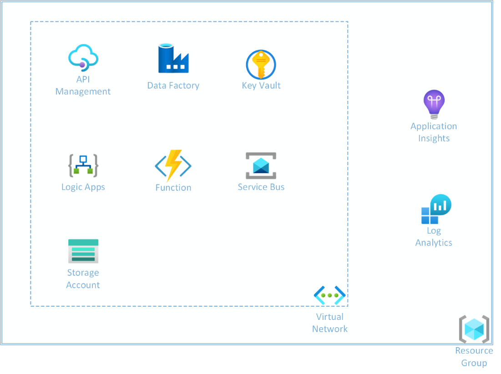

# Reference Implementation

All code and templates for the reference implementation (including the
*Deploy to Azure* sample) can be found here:

<https://github.com/Azure/Integration-Services-Landing-Zone-Accelerator/tree/main/src/infra>

Following the guidance in the earlier sections of this guide, we have
prepared a series of deployment templates, which will deploy all the
resources needed for an Enterprise-ready AIS installation, following the
recommended practices (e.g., placing resources inside a Virtual Network,
linking to Monitoring solutions). Once deployed, all a customer needs to
do is upload their own code/workflows/files to start using this
environment.

**Please note**: most of these resources require a Premium SKU to be
used with Virtual Networking. Deploying the example resources below will
start incurring costs based on those Premium SKUs, from the point at
which they are deployed.

The reference implementation consists of a series of ARM templates, that
can be deployed individually, or together using a *Deploy to Azure*
button.

You can deploy them all (with a User Interface to enter details)
using this Deploy to Azure button below:  
  

The reference implementation consists of the following resources:

The ARM templates deploy the following resources:

- Virtual Network

  - Single subnet

- Storage Account

- Log Analytics workspace

- Application Insights

  - Connected to the Log Analytics workspace

- Key Vault

- API Management

  - Uses Premium SKU

  - Connected to Application Insights

  - Diagnostic Setting to log to Log Analytics workspace

  - Deploy into VNet (Internal mode)

- Service Bus

  - Uses Premium SKU

  - Disables Public Network access

  - Creates Private Endpoint into VNet

  - Sets “Allow trusted Microsoft services to bypass this firewall” to
    true

- App Service Plans

  - Logic App (Standard) plan using WS3 SKU

  - Azure Function plan using Consumption SKU

- Logic App (Standard)

  - Uses WS3 App Service Plan

  - Uses existing storage account

  - Connected to Application Insights

  - Diagnostic Setting to log to Log Analytics workspace

  - Deployed into VNet

- Function App

  - Uses Consumption App Service Plan

  - Uses existing storage account

  - Connected to Application Insights

  - Diagnostic Setting to log to Log Analytics workspace

  - Deployed into VNet

- Data Factory

- Governance

  - Setup Defender for Cloud

<!-- -->

- *Deploy to Azure* template that deploys all the above as a single unit
  within Azure
