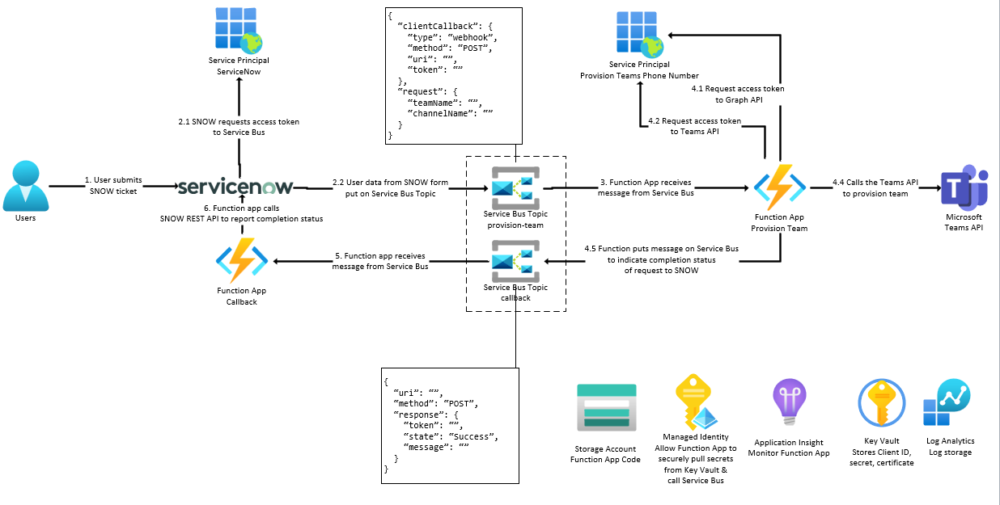

## Reference Implementation - Scenario 2

This reference implementation shows how to integrate [ServiceNow](https://www.servicenow.com/) with an Azure automation system built on [Service Bus](https://learn.microsoft.com/en-us/azure/service-bus-messaging/service-bus-messaging-overview) and [Azure Functions](https://learn.microsoft.com/en-us/azure/azure-functions/functions-overview).

In this example, the team had an existing PowerShell script that would interact with their Teams environment via the [Teams cmdlets](https://learn.microsoft.com/en-us/microsoftteams/teams-powershell-overview). This was run manually each time a ServiceNow ticket was received. The team wanted to automate this process, so that the PowerShell script would be run automatically whenever a new ServiceNow ticket was received.

### Architecture



Deploy this automation with 1 step.

[](https://portal.azure.com/#create/Microsoft.Template/uri/https%3A%2F%2Fraw.githubusercontent.com%2FAzure%2FIntegration-Services-Landing-Zone-Accelerator%2Fmain%2Fsrc%2Finfra%2Fscenario2%2F/bicep/%2Fias.template.json)

### Design Principles

- **Automate everything** - The team wanted to automate the entire process, so that the PowerShell script would be run automatically whenever a new ServiceNow ticket was received.
- **Generic, repeatable frontend design** - The team wanted a generic design that could be used for other integrations in the future. ServiceNow has forms for many different IT processes and wanted a generic way to call backend automations written by different teams without having to re-invent the integration each time.
- **Generic, repeatable backend design** - The team(s) that build backend automations want a platform that can run their code using whatever language it is already written in (PowerShell, Python, C#, Java, etc) and a generic way to receive requests to execute their code & a generic way to respond to the frontend.
- **Secure** - The team wanted to ensure that the solution was secure, and that only authorized users could call the backend automations. They also wanted private networking wherever possible.
- **Cost effective** - The team wanted to ensure that the solution was cost effective, and that they were only paying for the resources they needed.

### Azure services

- [Functions](https://learn.microsoft.com/en-us/azure/azure-functions/functions-overview)
  - Azure Functions will run the PowerShell script that interacts with the Teams API & call back to the ServiceNow API.
- [Service Bus](https://learn.microsoft.com/en-us/azure/service-bus-messaging/service-bus-messaging-overview)
  - Brokers the connection between ServiceNow & the Azure Function (or any other system).
- [Service Principal](https://learn.microsoft.com/en-us/azure/active-directory/develop/app-objects-and-service-principals#service-principal-object)
  - The identities that ServiceNow & the Azure Function will use to call the Service Bus & Teams API, respectively
- [Key Vault](https://learn.microsoft.com/en-us/azure/key-vault/key-vault-overview)
  - Securly stores any credentials the Azure Function needs to run the PowerShell script (such as the service prinicpal client ID & client secret)
- [Log Analytics & App Insights](https://learn.microsoft.com/en-us/azure/azure-monitor/overview)
  - Captures logs for all Azure services
- [Storage Account](https://learn.microsoft.com/en-us/azure/storage/common/storage-account-overview)
  - Stores the Azure Function code
- [Managed Identity](https://learn.microsoft.com/en-us/azure/active-directory/managed-identities-azure-resources/overview)
  - Used by the Azure Function to pull secrets from Key Vault

### Prerequisites

- [PowerShell](https://learn.microsoft.com/en-us/powershell/scripting/install/installing-powershell?view=powershell-7.3&viewFallbackFrom=powershell-7.1)
- [Azure CLI](https://learn.microsoft.com/en-us/cli/azure/install-azure-cli)
- [Azure Function CLI](https://learn.microsoft.com/en-us/azure/azure-functions/functions-run-local?tabs=v4%2Cwindows%2Ccsharp%2Cportal%2Cbash#install-the-azure-functions-core-tools)

### AzureAD setup

You will need to create 2 service principals in AAD. One that is the identity for ServiceNow to use to put messages on the Service Bus and one to allow the Azure Function PowerShell code to authenticate against the Teams API.

### ServiceNow AAD service principal setup

1.  Follow the instructions [here](https://learn.microsoft.com/en-us/azure/active-directory/develop/quickstart-register-app) to create a new AAD app registration.

>NOTE: In order for this service principal to be able to put a message on the Service Bus, it must have Role-Based-Access-Control (RBAC) permissions to the Service Bus namespace. You can [grant](https://learn.microsoft.com/en-us/azure/service-bus-messaging/authenticate-application#assign-azure-roles-using-the-azure-portal) the `Azure Service Bus Data Sender` role to the service principal at the namespace level. In this example, this is _done for you as part of the Infrastructure as Code deployment_.

1.  Take a note of the `object id` of the service principal (**not the app registration**). Search in the `Enterprise Applications` blade for your newly created service principal. You will need this later for the Infrastructure as Code deployment.

### Azure Function AAD service principal setup

1.  Follow the instructions [here](https://learn.microsoft.com/en-us/azure/active-directory/develop/quickstart-register-app) to create a new AAD app registration.

1.  Follow the instructions [here](https://learn.microsoft.com/en-us/azure/active-directory/develop/quickstart-configure-app-access-web-apis) to assign permissions to the service prinicpal to allow it to call the Teams API.

    - Follow the instructions [here](https://learn.microsoft.com/en-us/microsoftteams/teams-powershell-application-authentication#setup-application-based-authentication).

    >IMPORTANT: Note that you will need [admin consent](https://learn.microsoft.com/en-us/azure/active-directory/manage-apps/grant-admin-consent?pivots=portal) for the permissions to be granted for your tenant.

### Deployment

1.  Open the `src/infra/scenario2/bicep/env/dev.parameters.json` file and modify the values as appropriate.

1.  Open a shell and navigate to the `src/infra/scenario2/bicep` folder.

1.  Run the following command to deploy the infrastructure (it assumes you already have a resource group to deploy into)

    ```shell
    az deployment group create --resource-group <resource-group-name> --template-file ./main.bicep --parameters ./env/dev.parameters.json --parameters functionAADServicePrincipalClientId=<function-service-principal-client-id> functionAADServicePrincipalClientSecret=<function-service-principal-client-secret>  serviceNowAADServicePrincipalObjectId=<serviceNow-service-principal-object-id>
    ```

>NOTE: You must be on the same network as the Azure Function in order to publish to the SCM endpoint due to the private endpoint deployment.

1.  Navigate to the `src/code/scenario2/provision-teams` directory.

1.  Run the following command to deploy the `provision-teams` Azure Function PowerShell app.

    ```shell
    func azure functionapp publish <provision-teams-function-app-name>
    ```

1.  Navigate to the `src/code/scenario2/callback` directory.

1.  Run the following command to deploy the `callback` Azure Function PowerShell app.

    ```shell
    func azure functionapp publish <callback-function-app-name>
    ```

### Testing

1.  Run the following `curl` command to get an access token to the Service Bus (substitute your tenant ID, client ID, & client secret)

    ```powershell
    $accessToken = curl https://login.microsoftonline.com/<tenant-ID>/oauth2/v2.0/token -H "Content-Type: application/x-www-form-urlencoded" --data "grant_type=client_credentials&client_id=<client-id>&client_secret=<client-secret>&scope=https%3A%2F%2Fservicebus.azure.net%2F.default" | ConvertFrom-Json | Select-Object -ExpandProperty access_token
    ```

1.  Run the following `curl` command to put a message on the Service Bus (using the access token received in the previous step).

    ```powershell
    curl https://<service-bus-name>.servicebus.windows.net/provision-teams/messages -H "Authorization: Bearer $accessToken" -H "Content-Type: application/json" --data '{ "clientCallback": { "type": "webhook", "method": "POST", "uri": "https://service-now.com/api/", "token": "abc123" }, "request": { "ownerUserPrincipalName": "<user-principal-name-of-team-owner>", "teamName": "NewTeam", "channelName": "NewChannel" } }' -v
    ```

### Additional Considerations & reasons for Service Bus

ServiceNow, by default, expects a call to an external API to return within 30 seconds ([glide.http.outbound.max_timeout](https://docs.servicenow.com/bundle/tokyo-api-reference/page/integrate/web-services/reference/r_HTTPConnectionManagementProps.html)). In this example, some of the operations from the Teams API may take longer than 30 seconds to run (such as provisioning phone numbers in certain countries). Therefore, we need to ensure that there is a broker in between the ServiceNow frontend & the backend Azure Function. 

ServiceNow will authenticate using an Azure AD [Service Principal](https://learn.microsoft.com/en-us/azure/active-directory/develop/app-objects-and-service-principals#service-principal-object) and send a message to a [Service Bus topic](https://learn.microsoft.com/en-us/azure/service-bus-messaging/service-bus-queues-topics-subscriptions#topics-and-subscriptions). The Azure Function will then run the PowerShell script, using the data passed in from ServiceNow in the message body.

We also need a way to generically respond to ServiceNow when a message is complete. In this example, the Azure Function that runs the PowerShell script will respond back ServiceNow using a different topic `callback`. Another Azure Function is listening to this topic, and will respond back to ServiceNow with the result of the operation (using the `clientCallback.uri` field received in the initial topic message). ServiceNow generates a [unique URI](https://docs.servicenow.com/bundle/utah-integrate-applications/page/administer/integrationhub-store-spokes/task/govnotify-wbhk.html) for each request, and expects the response to be sent back to this URI

### Service Bus topics & message format

Service Bus supports [topics](https://learn.microsoft.com/en-us/azure/service-bus-messaging/service-bus-queues-topics-subscriptions#topics-and-subscriptions) which can be used to support a publish/subscribe pattern. Service Bus supports 10K topics per namespace, so we can make a new topic for each automation that teams want to create. This makes it so that ServiceNow only has to know about how to publish messages to a Service Bus topic, and doesn't need to know about the backend automation. Likewise, the backend automations don't have to know anything about ServiceNow, they just need to know how to subscribe to a Service Bus topic & publish a "callback" message to a different topic.

In this example, ServiceNow will publish a message to a topic called `provision-team`. The Azure Function will subscribe to this topic, and will receive the message. Service Now 

The initial request message will contain the following fields:

```json
{
  "clientCallback": {
    "type": "webhook", // type of callback request
    "method": "POST", // method of callback request
    "uri": "https://service-now.com/api/...", // URI to send callback request to
    "token": "abc123" // unique identifier for this request
  },
  "request": {
    "ownerUserPrincipalName": "", // the UPN of the user who will own the new Teams team
    "teamName": "NewTeam", //the name of the new Teams team to create
    "channelName": "NewChannel" //the name of the new Teams channel to create
  }
}
```

The Azure Function will process the `request` section and then use the `clientCallback` section to respond to ServiceNow via the Service Bus. It will add a new message to a generic `callback` topic with the information that ServiceNow will need to update its internal ticketing system.

The callback message will contain the following fields:

```json
{
  "uri": "https://service-now.com/api/...", // URI to send callback request to (from original message)
  "method": "POST", // how to call the ServiceNow URI (from original message)
  "response": {
    "token": "abc123", // the unique identifier for this request (from original message)
    "state": "Success", // the state of the request (Success or Failure)
    "message": "Team created successfully" // the message to send back to ServiceNow
  }
}
```

Another generic Azure Function will be listening to this `callback` topic, and will send the `response` section back to ServiceNow using the `uri` & `method` fields.

### Azure Active Directory

When the script was being run locally, it used the identity of the person running it to call the Teams API. However, when the Function run in Azure, it needs its own identity. This identity is an Azure AD Service Principal. This identity will have a set of scopes (API permissions) assigned to it so that it can call the Teams API in a similar fashion to the original script.

In addition, while ServiceNow could authenticate with the Service Bus using a [SAS token](https://learn.microsoft.com/en-us/azure/service-bus-messaging/service-bus-sas#shared-access-signature-authentication), it is preferred to use AAD authentication to protect the Service Bus. Therefore, ServiceNow will need to use [OAuth 2.0 authentication](https://docs.servicenow.com/bundle/tokyo-api-reference/page/integrate/outbound-rest/task/t_ConfigureARESTMessageWithOAuth-1.html) in order to get an access token that is valid for the Service Bus. In addition, this service principal needs to be granted RBAC (role-based access control) permissions to the Service Bus so that ServiceNow (running as the service principal identity) can post messages.